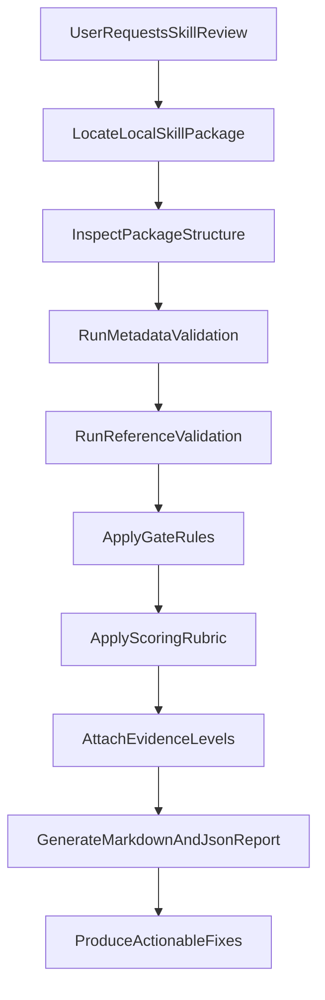

# skill-reviewer

`skill-reviewer` is a review skill for complete AI agent skill packages. It checks whether a target package meets minimum structural requirements, scores overall quality, attaches evidence levels to key findings, and returns actionable rewrite guidance.

This repository follows a structure inspired by official Agent Skills repositories: a focused `SKILL.md` entrypoint, separated rule references, reusable report assets, and lightweight helper scripts.

## What it does

- Reviews full skill packages, not just `SKILL.md`
- Runs gate checks for metadata, package structure, and broken references
- Scores quality across focus, trigger clarity, execution quality, resource organization, and failure defense
- Distinguishes `official`, `standard`, `example`, `best_practice`, and `heuristic` evidence
- Produces a Markdown report and a JSON result

## Install

### Option 1: local repository usage

Clone this repository and use it as a local skill package in a compatible agent environment.

### Option 2: community skills CLI

The following command is a community CLI installation path, not an Anthropic-specific official install flow:

```bash
npx skills add JustinBIBERRR/skill-reviewer
```

You can also inspect or target specific skills depending on the CLI features available in your environment:

```bash
npx skills add JustinBIBERRR/skill-reviewer --list
npx skills add JustinBIBERRR/skill-reviewer --skill skill-reviewer
```

## Review Flow



## Outputs

Each review should produce:

- a gate summary with rule IDs
- a quality score out of 100
- prioritized findings with evidence levels
- an evidence log with source links or citations
- actionable fixes for immediate, structural, and optional follow-up work
- a JSON result aligned with `assets/report-schema.json`

## Run the reviewer script

Generate both Markdown and JSON reports for a local target package:

```bash
py scripts/run_skill_review.py . --output-dir reports
```

### Quickstart

Review the current package:

```bash
py scripts/run_skill_review.py . --output-dir reports
```

Review another local skill directory with explicit target override:

```bash
py scripts/run_skill_review.py . --target "D:\path\to\target-skill" --output-dir reports
```

Enable strict mode to return exit code `2` when any blocker gate fails:

```bash
py scripts/run_skill_review.py . --target "D:\path\to\target-skill" --output-dir reports --strict
```

Exit code behavior:
- `0`: all gate checks pass
- `1`: at least one gate fails (non-strict mode)
- `2`: strict mode enabled and at least one blocker gate fails

## Repository Layout

```text
.
├── SKILL.md
├── README.md
├── references/
├── assets/
├── scripts/
└── tests/
```

### Key directories

- `references/`: gate rules, scoring rubric, principles, evidence policy, and source index
- `assets/`: Markdown and JSON output contracts
- `scripts/`: package inspection and validation helpers
- `tests/`: automated checks for the validation scripts

## Notes

- The current first version is optimized for local skill directories.
- Community CLI installation syntax may vary by skills toolchain.
- Treat this repository as a structured review system, not just a single prompt file.
